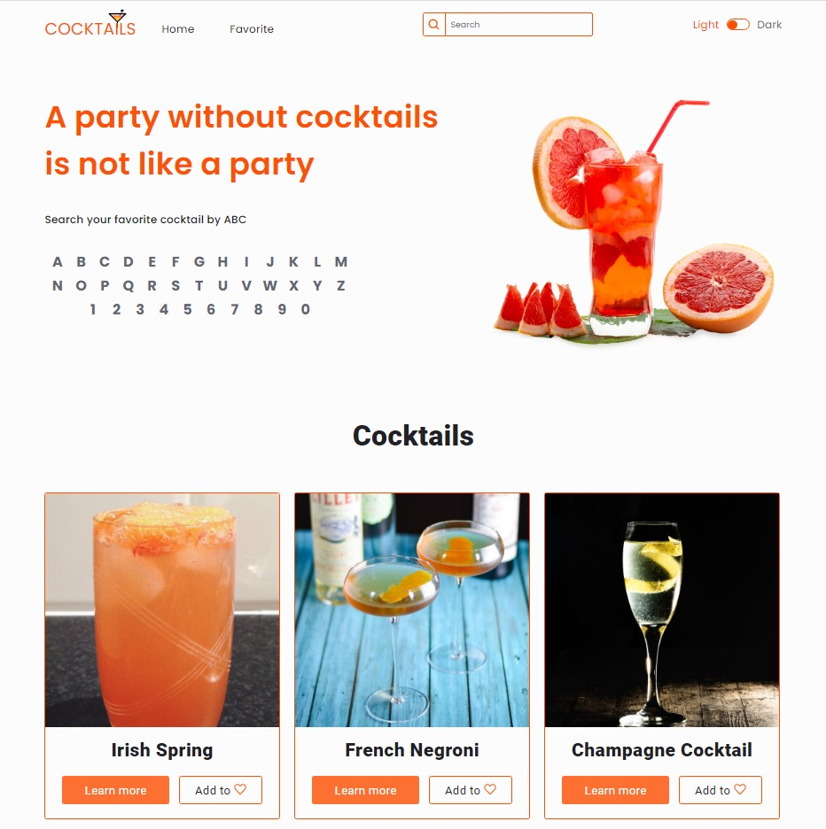

# Cocktails-app

The site will help you find your favorite cocktail, learn its recipe and
ingredients. Favorite cocktails and ingredients can be added to the favorites.
Cocktails can be searched by name, by first letter, and also among selected
ones. It is possible to switch between light and dark themes. The layout of the
site is adapted for different devices.

## Created with

:white_check_mark: JavaScript  
:white_check_mark: REST API  
:white_check_mark: Parcel  
:white_check_mark: HTML  
:white_check_mark: SASS

## Usage

To start the application, you need to open it in a web browser at
[link](https://andrii-posternak.github.io/cocktails/).

- To search for cocktails, you need to enter their name in the search bar in the
  page header and click search.
- To add cocktails or ingredients to the favorites, click the button "Add to" on
  any page.
- To remove cocktails or ingredients from the favorites, click the button
  "Remove" on any page.
- To switch between main pages and pages of favorites cocktails and ingredients
  are used navigation in the page header.
- To switch between light and dark theme is necessary toggle the switch in the
  page header.
